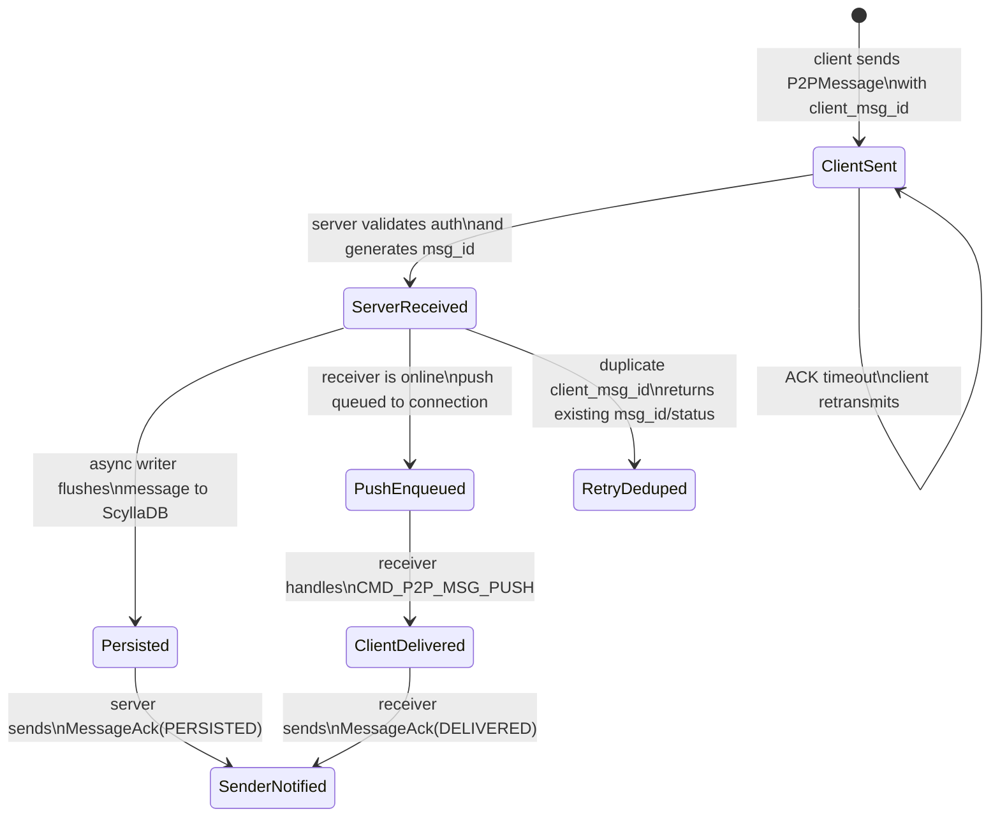

# TermChat

## 📖 Introduction
**TermChat** is a robust, CLI-based Instant Messaging system built with modern C++20. It leverages industry-proven technologies like the Reactor pattern (Epoll), Protocol Buffers for efficient serialization, and ScyllaDB for high-throughput data persistence. The project features a complete backend server and a rich TUI (Text User Interface) client built with FTXUI.

## 🛠 Tech Stack
- **Language**: C++20
- **Network Model**: Linux Epoll (Reactor Pattern) / Non-blocking I/O
- **Protocol**: Google Protobuf 3 (Binary Serialization)
- **Database**:
    - **ScyllaDB**: High-performance NoSQL for message storage (Current)
    - **MySQL**: Relational data (User auth/Friends) - *Legacy/Transition*
- **Client UI**: FTXUI (Functional Terminal User Interface)
- **Concurrency**: Thread Pool & Connection Pools
- **Build System**: CMake (Presets) + Vcpkg
- **DevOps**: Docker & DevContainer support

---

## 📂 Directory Structure

```text
/
├── client/              # FTXUI-based Terminal Client
│   ├── ui/              # UI Components (Auth, Chat, Friend panels)
│   ├── network_manager* # Client-side networking & state management
│   └── main.cpp         # Client entry point
├── server/
│   └── src/             # Core Backend Logic
│       ├── main.cpp     # Entry point
│       ├── core/        # Reactor core (Epoll, Webserver)
│       ├── service/     # Business Logic (Auth, Msg, Friend, Push)
│       ├── dao/         # Data Access Objects (ScyllaDB/MySQL)
│       ├── handler/     # Protocol Dispatchers (HTTP/Protobuf)
│       ├── pool/        # Connection Pools (Thread, SQL, Scylla)
│       └── buffer/      # Zero-copy buffer management
├── proto/               # Protobuf definitions (.proto files)
├── tests/               # Python Functional Tests & C++ Unit Tests
├── .devcontainer/       # VS Code DevContainer config
├── vcpkg.json           # Dependency management
└── docker-compose.yml   # Multi-container orchestration
```

---

## ✨ Features

### ✅ Core Functionality
- **High-Performance Server**: Event-driven architecture handling concurrent connections.
- **Protocol Buffers**: Compact and efficient binary message format.
- **Cross-Platform Client**: TUI client works on macOS, Linux, and Windows (via WSL/Docker).

### 🔐 Authentication & Security
- [x] **User Registration & Login**: Secure credential handling.
- [x] **JWT Authentication**: Stateless session management using JSON Web Tokens.
- [x] **Connection Management**: Heartbeats and automatic timeouts.

### 💬 Messaging
- [x] **P2P Messaging**: Real-time private messaging between users.
- [x] **Offline Messages**: Messages sent to offline users are stored (ScyllaDB) and pushed upon reconnection.
- [x] **Message History**: Persistent chat history retrieval.
- [x] **Rich TUI**: Scrollable chat history, real-time updates, and visual status indicators.
- [x] **Reliable Delivery**: Server-side message IDs, client retry, deduplication, incremental sync, and multi-stage ACKs.

### 🔁 Message Reliability State Machine

TermChat uses an explicit message state machine to separate network acceptance, durable persistence, online push, and receiver-side delivery confirmation. This keeps the sender UI, server storage path, and receiver push path observable independently.



| State | Meaning | Main owner |
| --- | --- | --- |
| `client_sent` | The client has sent the request and keeps it in the pending queue until an ACK or retry limit is reached. | Client |
| `server_received` | The server has authenticated the sender, accepted the request, generated the authoritative `msg_id`, and recorded the dedup key. | Server service |
| `persisted` | The async writer has flushed the message into ScyllaDB message tables. | Server DAO / async writer |
| `push_enqueued` | The server has placed the push message into the receiver connection's outgoing queue. | Push service |
| `client_delivered` | The receiver client has received `CMD_P2P_MSG_PUSH` and returned `MessageAck(DELIVERED)`. | Receiver client |

#### Scenario Analysis

- **Normal online delivery**: the sender receives an initial `ENQUEUED` ACK after the server accepts and queues the push, then receives async `PERSISTED` and `DELIVERED` ACKs as storage and receiver confirmation complete.
- **Receiver offline**: the message is still persisted in ScyllaDB. When the receiver reconnects, the client sends `last_ack_msg_id` and pulls only incremental messages instead of loading a fixed-size recent window.
- **Sender retry after timeout**: the client retransmits the same `client_msg_id`. The server uses the dedup table to return the original `msg_id` and current status instead of creating duplicate messages.
- **Push succeeds but persistence is slower**: online delivery and durable storage are decoupled. The state machine exposes both stages, which helps diagnose whether latency comes from network push or ScyllaDB writes.
- **Read receipts intentionally omitted**: the system focuses on reliable delivery and synchronization. `READ` is kept as an extensible protocol state, but the current implementation does not require UI-level read tracking.

### 👥 Social Graph
- [x] **Friend System**: Send, Accept, and Reject friend requests.
- [x] **Real-time Notifications**: Instant push notifications for friend requests and status updates.
- [x] **Contact List**: Dynamic friend list with online status (partial).

---

## 🗺️ Roadmap

- [ ] **Group Chat**: Implementation of multi-user chat rooms.
- [ ] **File Transfer**: Support for sending images and files.
- [ ] **End-to-End Encryption**: Integrate Signal Protocol or similar for privacy.
- [x] **Message Acknowledgement (ACK)**: Multi-stage ACKs for received, persisted, enqueued, and delivered states.
- [ ] **Search**: Full-text search for message history.
- [ ] **Metrics**: Prometheus/Grafana integration for server monitoring.

---

## 💻 Development Environment (Recommended)

This project is configured with a **DevContainer**. This is the preferred way to develop, as it provides a pre-configured environment with all dependencies (C++20, CMake, Vcpkg, MySQL, etc.).

1. Install [Docker Desktop](https://www.docker.com/products/docker-desktop).
2. Install [VS Code](https://code.visualstudio.com/) and the [Dev Containers extension](https://marketplace.visualstudio.com/items?itemName=ms-vscode-remote.remote-containers).
3. Open this folder in VS Code.
4. Click **"Reopen in Container"** when prompted (or use the command palette: `Dev Containers: Reopen in Container`).

### Build & Run (Inside DevContainer)

**Build:**
```bash
cmake --preset release && cmake --build build/release
```

```bash
cmake --preset debug && cmake --build build/debug
```

```bash
cmake --preset perf && cmake --build build/relwithdebinfo
```

Every time the sql files are changed, the project needs to be re-compiled to generate the C++ models.

**Run Server & Test:**
```bash
./build/debug/server/src/server
./build/release/server/src/server
./build/relwithdebinfo/server/src/server

# Run Server with log disabled
./build/debug/server/src/server -l 0
./build/release/server/src/server -l 0
./build/relwithdebinfo/server/src/server -l 0

# Test Auth
python3 tests/test_auth.py [username] [password]
# Test Friend System (including Push)
python3 tests/test_friend.py
# Test P2P Message System
python3 tests/test_message.py

# Test Benchmark
perf record -F 99 -p $(pgrep server) -g -- sleep 120
python3 tests/benchmark_im.py > ./log/benchmark_im.log 2>&1
# Generate flamegraph
perf script | stackcollapse-perf.pl | flamegraph.pl > perf.svg

# Test Smoke Test
go mod tidy
go run tests/smoke.go -addr 127.0.0.1:1316 -n 10000

# Run Client (FTXUI)
./build/debug/client/client
./build/release/client/client
./build/relwithdebinfo/client/client

# If you want to use db visualization with scylla, run the following commands in devcontainer terminal
apt-get update
apt install openjdk-21-jdk
```

---

## 🚀 Quick Start (Docker Compose)

If you just want to run the server without setting up a development environment:

```bash
docker-compose up --build
```

---

## 🖥️ Local Client Development (macOS/Linux)

If you want to run the **FTXUI Client** locally on your host machine while the backend runs in Docker, follow these steps. This setup isolates the server environment while giving you a native terminal UI experience.

### 1. Start the Backend (Docker)

Start the Server, MySQL, and ScyllaDB in the background. We mount the generated certificates so the server can connect securely.

```bash
# Build and start services in detached mode
docker compose up --build -d
```

### 2. Build the Client (Local)

We use a special CMake preset (`macos-debug`) that:
*   **Skips server dependencies** (MySQL, ScyllaDB drivers are NOT required locally).
*   **Only builds the client** and protocol buffers.
*   **Uses Ninja** for faster builds.

```bash
# 1. Configure the project (Client Only)
cmake --preset macos-debug

# 2. Build the client executable
cmake --build --preset macos-debug --target client
```

### 3. Run the Client

```bash
./build/macos-debug/client/client
```

### ❓ Troubleshooting

*   **Database Internal Error / TLS Error**:
    If the client says "Database internal error", check the server logs:
    ```bash
    docker compose logs server
    ```
    If you see `TLS/SSL error: No such file or directory`, ensure you ran `docker compose down -v` to reset the certificate volumes and that `docker-compose.yml` mounts `ssl-certs:/etc/mysql/certs:ro` for the server.

*   **CMake Error: Generator Ninja**:
    If you see an error about "Unix Makefiles" vs "Ninja", run `rm -rf build/macos-debug` to clear the cache.

---

**Code Formatting:**
Using Google Style for C++: PascalCase for class names and function names, snake_case for variable names.

```bash
find server/src tests -name "*.h" -o -name "*.cpp" | xargs clang-format -i
```

*Note: The server currently listens on port 1316.*
