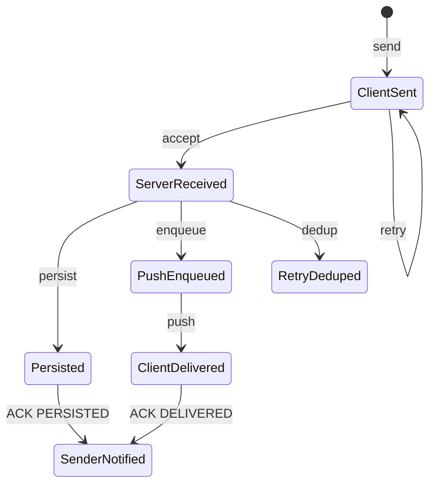

# Message Reliability State Machine

TermChat uses an explicit message state machine to separate network acceptance, durable persistence, online push, and receiver-side delivery confirmation. This keeps the sender UI, server storage path, and receiver push path observable independently.

## State Diagram

## States

| State | Meaning | Main owner |
| --- | --- | --- |
| `client_sent` | The client has sent the request and keeps it in the pending queue until an ACK or retry limit is reached. | Client |
| `server_received` | The server has authenticated the sender, accepted the request, generated the authoritative `msg_id`, and recorded the dedup key. | Server service |
| `persisted` | The async writer has flushed the message into ScyllaDB message tables. | Server DAO / async writer |
| `push_enqueued` | The server has placed the push message into the receiver connection's outgoing queue. | Push service |
| `client_delivered` | The receiver client has received `CMD_P2P_MSG_PUSH` and returned `MessageAck(DELIVERED)`. | Receiver client |

## Scenario Analysis

- **Normal online delivery**: the sender receives an initial `ENQUEUED` ACK after the server accepts and queues the push, then receives async `PERSISTED` and `DELIVERED` ACKs as storage and receiver confirmation complete.
- **Receiver offline**: the message is still persisted in ScyllaDB. When the receiver reconnects, the client sends `last_ack_msg_id` and pulls only incremental messages instead of loading a fixed-size recent window.
- **Sender retry after timeout**: the client retransmits the same `client_msg_id`. The server uses the dedup table to return the original `msg_id` and current status instead of creating duplicate messages.
- **Push succeeds but persistence is slower**: online delivery and durable storage are decoupled. The state machine exposes both stages, which helps diagnose whether latency comes from network push or ScyllaDB writes.
- **Read receipts intentionally omitted**: the system focuses on reliable delivery and synchronization. `READ` is kept as an extensible protocol state, but the current implementation does not require UI-level read tracking.
