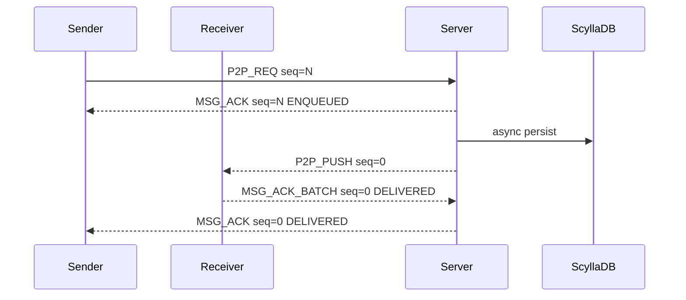

# Network Protocol Design

TermChat uses a small binary framing layer plus a Protobuf `Envelope`. TCP is treated as a byte stream; every application packet is length-prefixed so the receiver can reconstruct complete Protobuf messages before dispatch.

## Wire Frame

```text
0               4               4 + N
+---------------+---------------+
| uint32 length | Envelope bytes |
+---------------+---------------+
```

- `length` is a 4-byte big-endian unsigned integer.
- `Envelope bytes` is a serialized Protobuf `im.Envelope`.
- The current client and benchmark reject frames larger than 10 MiB to avoid unbounded allocation.
- A TCP read may contain partial frames or multiple frames; the connection buffer accumulates bytes until a full frame is available.

## Envelope

`proto/protocol.proto` defines the command namespace and the common envelope:

```text
Envelope {
  seq       uint64
  cmd       CommandType
  timestamp int64
  payload   oneof
}
```

`seq` is the request correlation id. Client requests use non-zero `seq`; the server response for that request returns the same `seq`. Server-initiated pushes use `seq = 0`, so clients can distinguish async events from request responses.

## Command Groups

| Range | Commands | Purpose |
| --- | --- | --- |
| 1-2 | `CMD_REGISTER_*` | Register request/response |
| 10-11 | `CMD_LOGIN_*` | Login request/response |
| 20-22 | `CMD_HEARTBEAT`, `CMD_LOGOUT_*` | Connection liveness and logout |
| 30-34 | `CMD_FRIEND_*` | Friend request, response, list, and push |
| 50-55 | `CMD_P2P_MSG_*`, `CMD_MSG_ACK*`, `CMD_SYNC_OFFLINE_*` | Message send, push, ACK, ACK batch, and incremental sync |

## P2P Send Flow



The first `MSG_ACK` is a request-response ACK and proves the server accepted the message, generated `msg_id`, and either queued online delivery or accepted durable offline delivery. `PERSISTED` and `DELIVERED` are async facts and may arrive later with `seq = 0`.

## Pipelining

The protocol supports multiple in-flight requests on one TCP connection because responses are correlated by `Envelope.seq`. A client does not need to wait for ACK of request `N` before sending request `N+1`.

The Go benchmark exposes this with `-inflight`:

```bash
go run ./tests/perf \
  -addr 127.0.0.1:1316 \
  -n 10000 \
  -payload 256 \
  -inflight 64 \
  -scenario single_conn_inflight_64 \
  -out benchmark-results/single-conn-inflight-64
```

`-inflight 1` keeps the original sequential mode. Larger values measure protocol pipeline throughput and server-side queueing behavior on a single TCP connection.

## ACK Handling Rules

- Request-response ACKs use the original non-zero `seq`.
- Server pushes and async status updates use `seq = 0`.
- `CMD_MSG_ACK_BATCH` is used by the receiver client to batch delivered confirmations.
- Clients merge ACKs as independent facts instead of assuming a strict enum order. For example, `PERSISTED` can arrive before or after `DELIVERED`.

## Incremental Sync

Offline sync uses cursor-style input such as `last_ack_msg_id` instead of pulling a fixed recent window. This keeps reconnect cost proportional to missed messages, not total conversation history size.
